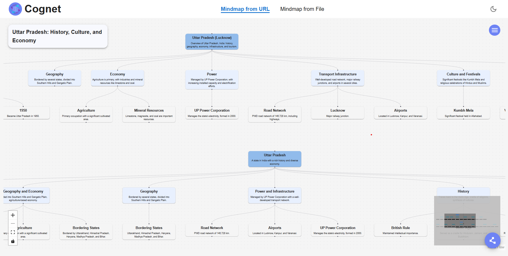
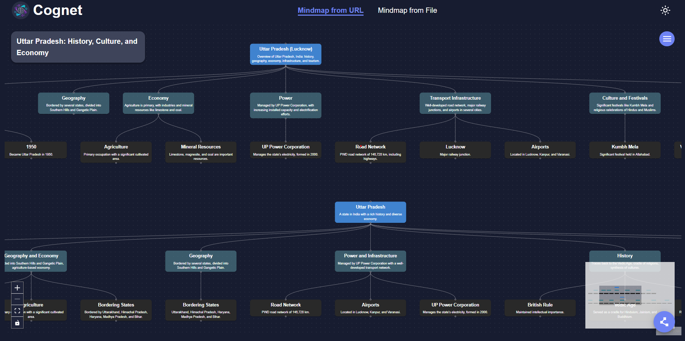
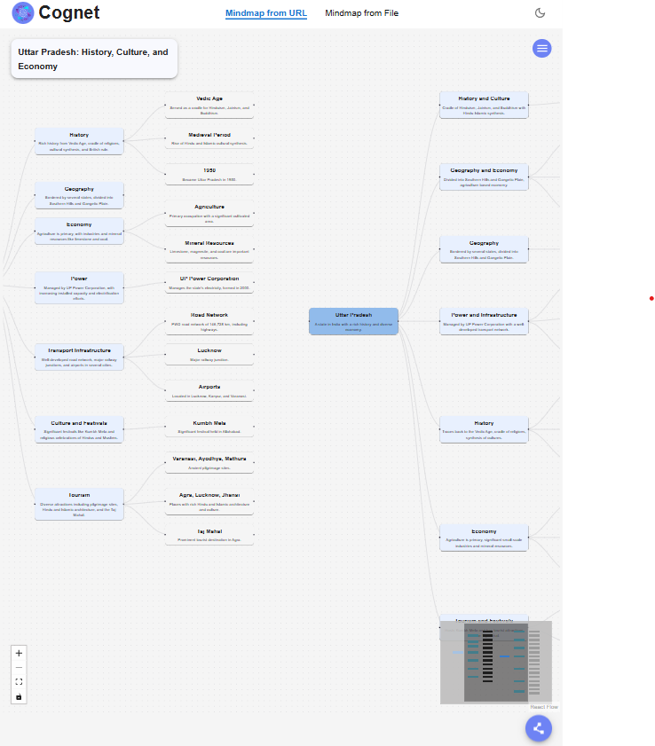
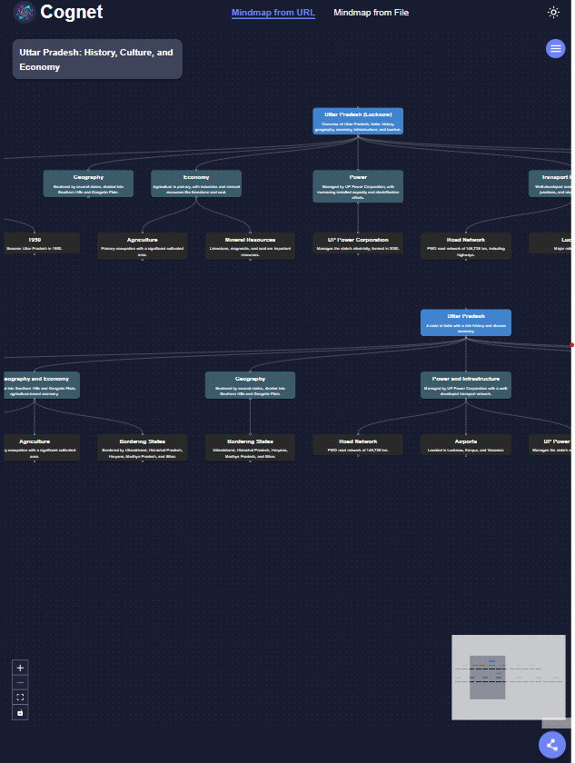
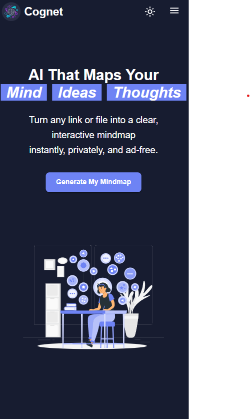

# 🧠 Cognet – Agentic AI-Powered Mind Mapping Tool Designed for Learners, Researchers, and Professionals

  

**Cognet** is a next-generation **AI-powered mind mapping application** that transforms URLs and uploaded files into **interactive, intelligent mind maps** in real-time. Built with agentic AI and real-time streaming, Cognet helps you **organize, visualize, and share ideas effortlessly**—perfect for students, professionals, and creative thinkers alike. 🚀  

With Cognet, the AI doesn’t just generate nodes—it **understands your content**, suggests meaningful connections, and delivers results **as you watch**. Everything is lightweight, fast, and completely **ad-free**.  

---

## ✨ Key Features

- **Interactive Mind Maps** – Dynamically create and organize ideas.  
- **Update Nodes** – Modify content directly on nodes.  
- **AI-Powered Insights** – Smart suggestions and connections between ideas.  
- **Export & Share** – Export as **Image, PDF, or JSON**, or share live links.  
- **Cross-Platform Access** – Desktop, tablet, and mobile friendly.  
- **Task & Idea Management (Coming Soon)** – Track and organize ideas efficiently.  
- **Real-Time Streaming (SSE)** – Watch your mindmap build live as AI generates nodes.  

---

## 🛠️ Tech Stack

**Frontend:** Next.js, Reactflow, MUI, Framer Motion  
**Backend:** FastAPI, Python, LangChain (OpenAI + Gemini), PyMuPDF  
**Real-Time Updates:** Server-Sent Events (SSE)  

**AI Agents:**  
1. **URL Fetching Agent** – Retrieves content from URLs  
2. **File Extraction Agent** – Extracts text from uploaded PDF or TXT files  
3. **Title Generation Agent** – Creates concise, relevant title of the content  
4. **Mindmap Generation Agent** – Automatically organizes content into structured nodes  

---

## 🖼️ Screenshots

### 💻 Laptop

 | 

### 📱 Tablet & Mobile

| Tablet | Mobile |
|--------|--------|
|  |  |
|  |  |

---

## ⚡ How It Works

1. **Add Your Thoughts** – Paste a URL or upload a file (≤2MB)  
2. **AI Agents Process Content** – Content is fetched, extracted, and analyzed automatically  
3. **Mindmap Generation** – AI organizes your ideas into nodes with logical relationships  
4. **Export & Share** – Save as **Image, PDF, JSON**, or share a live link instantly  

---

## 🚀 Getting Started Locally

### Prerequisites

- [Node.js](https://nodejs.org/) (v18+)  
- [Python](https://www.python.org/) (v3.10+)  
- [pip](https://pip.pypa.io/en/stable/)  

---

- A valid [OpenAI API key](https://platform.openai.com/account/api-keys)
- A valid [Gemini API key](https://aistudio.google.com/app/apikey)

---

## 🛠️ Installation

Follow these steps to clone and run the app locally:

### Clone the Repository

```bash
git clone https://github.com/jitesh-95/Cognet.git
cd cognet
```

### 1. Backend Setup (Create a Virtual Environment (optional but recommended))

```bash
cd backend
python -m venv venv
source venv/bin/activate   # On Windows: venv\Scripts\activate
```

### Install Dependencies

```bash
pip install -r requirements.txt
```

---

## 🔐 Setup `.env` File

Create a `.env` file in the root directory of the project and add your OpenAI API key like this:

```bash
OPENAI_API_KEY=your_openai_api_key_here
GEMINI_API_KEY=your_gemini_api_key_here

```

> 🔒 Make sure `.env` is listed in `.gitignore` to keep your key secure.

---

## ▶️ Running the Backend

After setting up everything, start the FastAPI app using:

```bash
uvicorn main:app --reload
```

## ▶️ Access the Docs

Visit browser and paste:

```bash
http://localhost:8000/docs
```
---

## 🧠 Powered by

- [OpenAI](https://platform.openai.com/docs/overview)  
- [Gemini](https://ai.google.dev/gemini-api/docs)  
- [Python](https://www.python.org/) 
---

### 2. Frontend Setup

```bash
cd frontend
```
---
### Install Dependencies

```bash
npm install
```
---

## 🔐 Setup `.env` File

Create a `.env` file in the root directory of the project and add:
```bash
NEXT_PUBLIC_API_BASE_URL = http://localhost:8000
```
---

## ▶️ Running the Frontend

After setting up everything, start the Next.js app using:

```bash
npm run dev

```
---

## Open http://localhost:3000 in your browser to access the application!

---

## 🧠 Powered by

- [Next.js](https://nextjs.org/)  
- [Reactflow](https://reactflow.dev/)  

---

<div align="center">
<h3><i>💡 Empowering Your Ideas, 🔒 Protecting Your Mind</i></h3>
<h3>Made with ❤️ using Agentic AI, FastAPI, and LangChain for smarter mind mapping.</h3>
</div>


